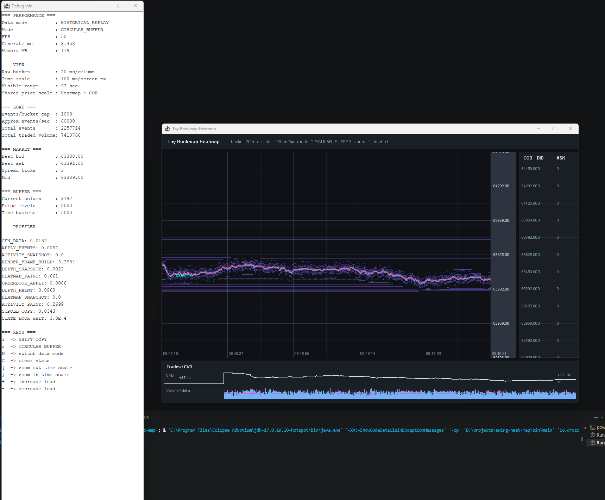

# Как далеко можно зайти с Java Swing в real-time визуализации?

Статус: живой черновик.

Этот текст обновляется одновременно с исследованием. Он не должен ждать окончания проекта.

---

## Вступление

Java Swing обычно вспоминают в разговорах о старых корпоративных приложениях. Мне было интересно проверить более практичный вопрос: можно ли использовать обычный Swing для интерфейса, который постоянно принимает данные и обновляет сложную визуализацию почти в реальном времени.

Так появился прототип heatmap, вдохновлённый интерфейсами визуализации рыночной активности. Это не торговый продукт и не попытка повторить Bookmap. Проект нужен мне как инженерный полигон: построить работающую систему, увеличить нагрузку, увидеть ограничения и проверить оптимизации измерениями.

Сейчас приложение уже показывает heatmap, стакан, исторические сделки, CVD и внутренние метрики. Но начиналось всё с одного `JPanel`, двумерного массива и `Swing Timer`.



---

## Первая работающая версия

Первый рабочий коммит — `b0658a5` с сообщением `initial commit - success render with stubs`.

Вся визуализация помещалась в одном `HeatmapPanel`:

```java
private static final int PRICE_LEVELS = 200;
private static final int TIME_BUCKETS = 800;

private final int[][] heatmap =
        new int[PRICE_LEVELS][TIME_BUCKETS];
```

Каждые 100 миллисекунд `Swing Timer` генерировал новую порцию данных и вызывал `repaint()`:

```java
Timer timer = new Timer(100, e -> {
    generateFakeData();
    repaint();
});
```

Чтобы добавить новую колонку справа, каждая строка матрицы сдвигалась влево:

```java
for (int y = 0; y < PRICE_LEVELS; y++) {
    System.arraycopy(
            heatmap[y],
            1,
            heatmap[y],
            0,
            TIME_BUCKETS - 1
    );
}
```

После этого `paintComponent` проходил по матрице `200 × 800` и рисовал все непустые ячейки.

На исходных параметрах этого было достаточно. Приложение работало, а реализация была маленькой и понятной. Проблема появилась не потому, что Swing сразу оказался «слишком медленным», а потому, что следующий вариант начал выполнять заметно больше работы.

Одна новая колонка выглядела дешёвой операцией, но фактически требовала сдвинуть:

```text
200 × 799 = 159 800 int
```

При интервале 100 мс это даёт верхнеуровневую оценку около 1,6 млн перемещений `int` в секунду. Полный проход `paintComponent` добавляет до 1,6 млн проверок ячеек в секунду, если панель действительно отрисовывается десять раз.

Эти цифры не являются benchmark: `repaint()` асинхронен, а Swing может объединять запросы перерисовки. Это оценка запрошенной работы, а не фактически измеренная пропускная способность.

> Здесь нужен screenshot первого коммита.

---

## Когда простая демонстрация превратилась в нагрузку

Через несколько коммитов вместо случайных пятен появился synthetic order book. Таймер стал срабатывать каждые 16 миллисекунд, а за один tick применялось 1000 событий.

При сохранении матрицы `200 × 800` теоретическая запрошенная работа выросла примерно до:

```text
9,6 млн перемещений int в секунду
9,6 млн проверок ячеек в секунду
до 60 000 synthetic events в секунду
```

Это всё ещё не измерение. Именно расхождение между «что код просит выполнить» и «что реально успевает выполнить EDT» становится предметом следующего эксперимента.

Кандидаты для воспроизводимого эксперимента:

- `45d73e8` — synthetic order book, 1000 событий за tick;
- `c5c2073` — те же основные параметры вынесены в `MarketConfig` и показаны на экране.

При этом основной подход оставался прежним:

- генерация данных;
- обновление order book;
- сдвиг всей heatmap;
- построение новой колонки;
- полный проход при отрисовке;
- всё управляется Swing Timer.

Именно это состояние нужно воспроизвести и измерить. Пока рано утверждать, что главным bottleneck было копирование строк, полный render loop или работа на EDT.

> Здесь появятся параметры выбранного baseline и первая измеренная деградация.

---

## Гипотезы

По коду подозрительно выглядят сразу несколько мест:

1. `System.arraycopy` для каждой строки heatmap.
2. Полный проход по `PRICE_LEVELS × TIME_BUCKETS` при каждом repaint.
3. Создание `Color` внутри render loop.
4. Генерация и применение событий на EDT.
5. Частота обновления около 60 раз в секунду.

Этот список пока не является результатом. Он нужен, чтобы заранее зафиксировать предположения и затем проверить их измерениями.

---

## Измерения

> Заполнить после выбора нагрузочного baseline.

Нужно зафиксировать:

- конфигурацию машины;
- Java-версию;
- размеры матрицы;
- events per tick;
- фактический FPS;
- generate/update time;
- shift/copy time;
- paint time;
- allocation rate и GC;
- hot methods на EDT.

---

## Что оказалось bottleneck

> Пока неизвестно. Не заполнять догадками.

---

## Изменение реализации

> Добавить только после измерения «до» и минимального проверяемого изменения.

---

## Результат

> Таблица «до/после» появится после повторяемого теста.

---

## Что я понял

Пока подтверждён только первый вывод:

> Работающая маленькая демонстрация и воспроизводимый performance experiment — это разные этапы проекта.

Первый коммит хорошо объясняет идею. Следующие состояния репозитория должны помочь найти момент, когда простая архитектура перестала укладываться в поставленную нагрузку.

---

## Следующий шаг

Сохранить чистый кадр `b0658a5`, затем сравнить `45d73e8` и `c5c2073` и выбрать один из них как нагрузочный baseline.
