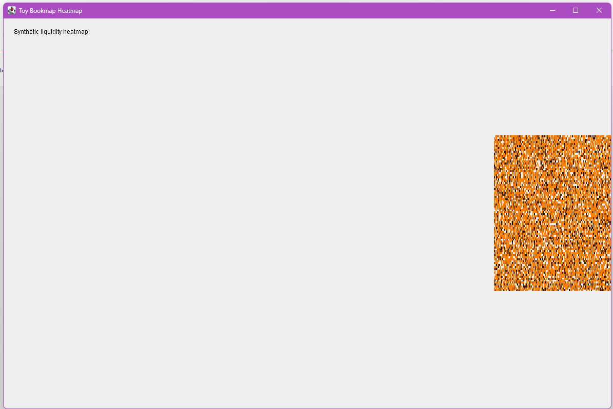
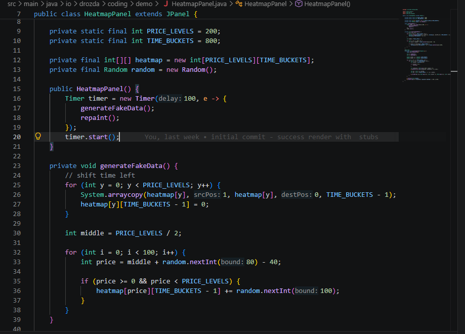

# Swing heatmap: сколько стоит одна новая колонка

Статус: готово к публикации после добавления 2–3 изображений.

Рекомендуемые labels:

```text
java, swing, performance, visualization
```

---

В [прошлой записи](https://iavnfgv.blogspot.com/2026/06/swing-10.html) я показал, во что постепенно превратился мой эксперимент с Java Swing.

Теперь сделаем несколько шагов назад — туда, где ещё нет стакана, CVD, исторических данных и небольшого зоопарка внутренних метрик.

Есть один `JPanel`.

И он уже очень старается.

Эта часть не про то, что `int[][]` — зло, а `System.arraycopy` надо срочно запретить постановлением правительства.

Скорее наоборот: перед тем как героически оптимизировать код, полезно хотя бы на салфетке посчитать, какую работу мы вообще просим выполнить.

В этой записи я хочу сделать именно это:

- взять первую рабочую версию;
- найти операции, которые выполняются каждый tick;
- прикинуть их стоимость в секунду;
- понять, где стоит измерять, а где пока рано доставать огнетушитель.

Это не заменяет профайлер. Но хорошо защищает от оптимизации по ощущениям. А ощущения у разработчика, как известно, иногда работают на генераторе случайных чисел.

## Первый рабочий коммит

Первый рабочий коммит называется честно:

```text
b0658a5 initial commit - success render with stubs
```

Никакой ложной скромности. Успешно отрендерили заглушки — сразу фиксируем историческое достижение.

Вся heatmap хранилась в обычной матрице:

```java
private static final int PRICE_LEVELS = 200;
private static final int TIME_BUCKETS = 800;

private final int[][] heatmap =
        new int[PRICE_LEVELS][TIME_BUCKETS];
```

То есть:

- 200 ценовых уровней;
- 800 временных колонок;
- 160 000 ячеек.



Первая версия выглядела примерно так: много пустоты, немного оранжевого шума и честное окно `Toy Bookmap Heatmap`.

## Что происходило каждые 100 миллисекунд

Главный цикл выглядел почти неприлично понятно:

```java
Timer timer = new Timer(100, e -> {
    generateFakeData();
    repaint();
});
```

Каждые 100 миллисекунд:

1. старые данные сдвигались влево;
2. справа создавалась новая колонка;
3. Swing получал просьбу перерисовать панель.

Слово «просьбу» здесь стоит воспринимать буквально. `repaint()` не рисует немедленно, а ставит перерисовку в очередь EDT. Swing ещё подумает, когда именно заняться нашими художествами.

## Один маленький сдвиг

Для добавления новой колонки каждая строка массива сдвигалась на одну позицию:

```java
for (int y = 0; y < PRICE_LEVELS; y++) {
    System.arraycopy(
            heatmap[y],
            1,
            heatmap[y],
            0,
            TIME_BUCKETS - 1
    );

    heatmap[y][TIME_BUCKETS - 1] = 0;
}
```

Выглядит вполне невинно. Тем более `System.arraycopy` — не самописный цикл, JVM умеет выполнять его достаточно эффективно.

Но полезно посчитать масштаб:

```text
200 строк × 799 элементов = 159 800 скопированных int за tick
```

При интервале 100 мс получается до десяти таких обновлений в секунду:

```text
примерно 1,6 млн перемещений int в секунду
```

Это ещё не диагноз. Последовательное копирование примитивов может быть очень быстрым. Но теперь хотя бы понятно, что «добавить одну колонку» физически означает «передвинуть почти всю историю».

Название метода и цена операции иногда живут в разных районах города.

## Затем приходит paintComponent

После обновления данных `paintComponent` снова проходил по всей матрице:

```java
for (int y = 0; y < PRICE_LEVELS; y++) {
    for (int x = 0; x < TIME_BUCKETS; x++) {
        int volume = heatmap[y][x];

        if (volume == 0) {
            continue;
        }

        int intensity = Math.min(255, volume * 4);
        g.setColor(new Color(intensity, intensity / 2, 0));
        g.fillRect(...);
    }
}
```

Ещё 160 000 проверок на одну отрисовку.

Не каждая ячейка превращалась в прямоугольник — пустые значения пропускались. Но проверить значение всё равно нужно.

Если представить десять полных отрисовок в секунду, получим ещё примерно:

```text
1,6 млн проверок ячеек в секунду
```

Цифры сами по себе не выглядят катастрофическими для современного процессора. Поэтому первая версия и работала нормально.

И это важный момент: простой код не был ошибкой. Для первой задачи он был вполне разумным.



На скриншоте видно главное: `Timer`, `generateFakeData()`, `repaint()` и тот самый сдвиг строк через `System.arraycopy`.

## Небольшая магия: цвет и координаты

В первой версии были ещё несколько строк, которые на первый взгляд выглядят как заклинание из учебника по Swing:

```java
double cellW = w / (double) TIME_BUCKETS;
double cellH = h / (double) PRICE_LEVELS;

int intensity = Math.min(255, volume * 4);
g.setColor(new Color(intensity, intensity / 2, 0));

int px = (int) (x * cellW);
int py = (int) ((PRICE_LEVELS - 1 - y) * cellH);

g.fillRect(
        px,
        py,
        Math.max(1, (int) cellW + 1),
        Math.max(1, (int) cellH + 1)
);
```

На самом деле здесь три простые идеи.

Первая: размер одной ячейки на экране.

```java
double cellW = w / (double) TIME_BUCKETS;
double cellH = h / (double) PRICE_LEVELS;
```

Если у нас 800 временных колонок, а окно шириной 1200 пикселей, одна колонка занимает примерно `1.5` пикселя. Если 200 ценовых уровней и окно высотой 700 пикселей, один уровень занимает примерно `3.5` пикселя.

То есть массив не рисуется “как есть”. Каждая ячейка массива сначала переводится в прямоугольник на экране.

Вторая идея: объём превращается в цвет.

```java
int intensity = Math.min(255, volume * 4);
g.setColor(new Color(intensity, intensity / 2, 0));
```

`volume` — это число в ячейке heatmap. Чем оно больше, тем ярче должен быть квадратик.

`volume * 4` просто усиливает эффект, чтобы маленькие значения не были почти чёрными. А `Math.min(255, ...)` ставит потолок, потому что RGB-канал не может быть больше `255`.

Дальше цвет собирается так:

```text
red   = intensity
green = intensity / 2
blue  = 0
```

Получается оранжевый: чем больше объём, тем ярче “жар”.

Третья идея: координаты массива переводятся в координаты Swing.

```java
int px = (int) (x * cellW);
int py = (int) ((PRICE_LEVELS - 1 - y) * cellH);
```

С `x` всё почти честно:

```text
x = 0   → левый край
x = 799 → правый край
```

А вот с `y` есть ловушка. В массиве `y` — это ценовой уровень. Логически хочется, чтобы большие цены были выше. Но в Swing координата `y = 0` находится сверху, а дальше `y` растёт вниз.

Поэтому появляется переворот:

```java
PRICE_LEVELS - 1 - y
```

Без него график был бы нарисован вверх ногами. Не катастрофа, конечно, но рынок и так достаточно унижает людей — не надо ещё и ось цены переворачивать.

И последняя маленькая страховка:

```java
Math.max(1, (int) cellW + 1)
Math.max(1, (int) cellH + 1)
```

Она гарантирует, что прямоугольник будет хотя бы `1 × 1` пиксель. Если окно маленькое или колонок слишком много, `cellW` может стать меньше одного пикселя. После приведения к `int` это легко превращается в `0`, а прямоугольник шириной `0` Swing нарисует примерно никак. Очень быстро, но бесполезно.

В итоге вся “магия” сводится к простому конвейеру:

```text
heatmap[y][x]
→ volume
→ яркость оранжевого
→ x/y массива
→ px/py на экране
→ fillRect(...)
```

На этом месте первую версию уже можно считать разобранной.

Она не была “плохой”. Наоборот, для первого шага это почти идеальный вариант: один `JPanel`, один двумерный массив, один `Timer`, один метод генерации и один метод рисования.

Плюс она честно показывает базовую механику:

- время — это столбцы;
- цена — это строки;
- объём — это яркость;
- движение времени — это сдвиг массива влево;
- картинка на экране — это перевод ячеек массива в прямоугольники Swing.

Дальше можно было бы сразу прыгнуть в оптимизации, но пока рано доставать каску и говорить “мы всё перепишем”.

Сначала надо немного усложнить мир.

В следующей части добавим synthetic order book: появятся заявки, сделки, bid/ask и больше событий на каждый tick. И вот тогда уже станет интереснее: простая heatmap перестанет быть просто оранжевым шумом и начнёт вести себя как маленький рыночный организм.

Спойлер: организм будет нервный.

Код проекта:

https://github.com/IavnFGV/swing-heat-map
