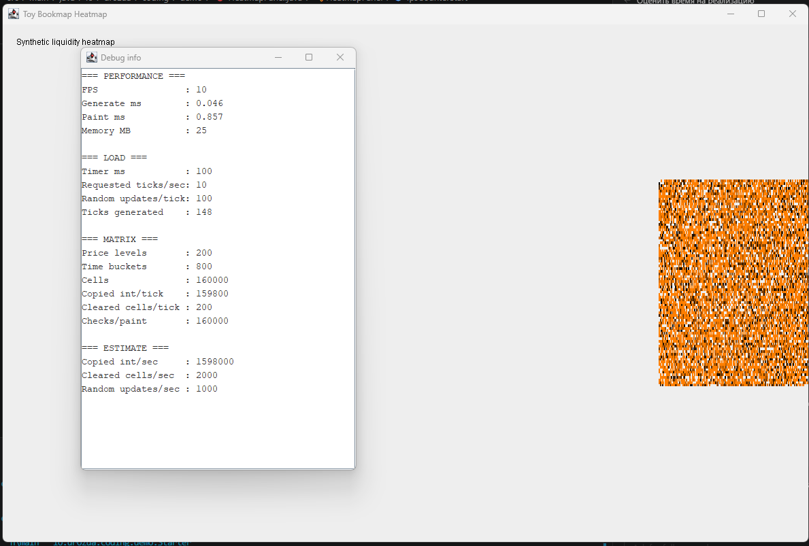

# Swing - 10 лет спустя - 3

Статус: черновик для третьей публикации.

Тема: тот же базовый heatmap, но с первым runtime profiler.

Рекомендуемые labels:

```text
java, swing, performance, profiler, visualization
```

Перед публикацией желательно добавить:

- screenshot ugly heatmap + debug window: `artifacts/profiler/01-profiler-ui.png`;
- screenshot `Profiler.java`: `artifacts/profiler/02-profiler-code.png`;
- screenshot `HeatmapPanel` с `Profiler.measure(...)`: `artifacts/profiler/03-measure-points.png`.

Demo branch:

```text
demo/ugly-heatmap-profiler
18f3cb1 Add profiler window to baseline heatmap
```

---

В прошлой части мы разобрали первую версию heatmap: один `JPanel`, один двумерный массив, один `Timer` и оранжевые квадратики.

Она была страшненькая, но честная.

И это важно сохранить.

Мне не хочется сейчас перескакивать к красивой версии проекта, где уже есть отдельные панели, стакан, графики, CVD и маленький зоопарк классов. Это будет другая история.

Сейчас задача проще:

> оставить тот же базовый heatmap, но добавить рядом окно с измерениями.

То есть не “переписываем приложение”, а “прикручиваем спидометр к телеге”.

## Зачем вообще добавлять profiler

В прошлой части мы посчитали примерную цену первой версии:

```text
≈ 1.6 млн копирований int / сек
≈ 1.6 млн проверок ячеек / сек
+ цвет, координаты и fillRect для непустых ячеек
```

Это ещё не страшно. Но уже понятно, что дальше гадать будет опасно.

Можно начать спорить:

- виноват `System.arraycopy`;
- нет, виноват `paintComponent`;
- нет, виноват `new Color`;
- нет, Swing старый;
- нет, просто день такой.

Это весёлый способ провести вечер, но плохой способ заниматься производительностью.

Поэтому следующий шаг — не оптимизация.

Следующий шаг — измерения.

## Оставляем тот же ugly heatmap

Важно: heatmap остаётся той же.

Данные всё ещё лежат здесь:

```java
private static final int PRICE_LEVELS = 200;
private static final int TIME_BUCKETS = 800;

private final int[][] heatmap = new int[PRICE_LEVELS][TIME_BUCKETS];
```

Таймер всё ещё простой:

```java
private static final int TIMER_MS = 100;
private static final int RANDOM_UPDATES_PER_TICK = 100;
```

Каждый tick:

- сдвигает историю влево;
- очищает последнюю колонку;
- добавляет 100 случайных обновлений;
- просит Swing перерисовать панель.

То есть это всё ещё тот самый прототип. Просто теперь рядом будет табличка с цифрами.



Вот так это выглядит: тот же простой heatmap, но рядом уже есть окно с FPS, временем генерации, временем рисования и расчётами по матрице.

## Окно Debug info

Для вывода метрик добавляем отдельное окно:

```java
public class InfoFrame extends JFrame {

    private final JTextArea textArea = new JTextArea();

    public InfoFrame() {
        super("Debug info");

        textArea.setFont(new Font(Font.MONOSPACED, Font.PLAIN, 14));
        textArea.setEditable(false);

        setContentPane(new JScrollPane(textArea));
        setSize(420, 420);
        setLocation(1250, 100);
    }

    public void updateText(String text) {
        textArea.setText(text);
    }
}
```

Никакой магии: обычный `JFrame`, внутри `JTextArea`.

`setLocation(1250, 100)` просто ставит окно правее основного приложения: 1250 пикселей от левого края экрана и 100 пикселей сверху. Это не performance-идея, а бытовая попытка не закрывать heatmap окном с цифрами.

В `Starter` теперь создаются два окна:

```java
InfoFrame infoFrame = new InfoFrame();

JFrame frame = new JFrame("Toy Bookmap Heatmap");
frame.setContentPane(new HeatmapPanel(infoFrame));

frame.setVisible(true);
infoFrame.setVisible(true);
```

Основной heatmap остаётся на месте. Просто рядом появляется “приборная панель”.

## Маленький Profiler

Сам profiler тоже максимально простой:

```java
public final class Profiler {

    private static final Map<EventType, Double> metrics =
            new ConcurrentHashMap<>();

    public static void measure(EventType eventType, Runnable runnable) {
        long start = System.nanoTime();

        try {
            runnable.run();
        } finally {
            metrics.put(
                    eventType,
                    (System.nanoTime() - start) / 1_000_000.0
            );
        }
    }

    public static double get(EventType eventType) {
        return metrics.getOrDefault(eventType, 0.0);
    }

    public enum EventType {
        GENERATE_DATA,
        PAINT
    }
}
```

Идея такая:

1. запомнили время до операции;
2. выполнили операцию;
3. посчитали разницу;
4. сохранили последнее значение в миллисекундах.

Это не промышленный profiling.

Это первый фонарик.

> Здесь вставить screenshot: `artifacts/profiler/02-profiler-code.png`.

## Куда навешиваем измерения

Первое место — генерация данных:

```java
Timer timer = new Timer(TIMER_MS, e -> {
    Profiler.measure(
            Profiler.EventType.GENERATE_DATA,
            this::generateFakeData
    );

    updateDebugInfo();
    repaint();
});
```

Теперь мы видим, сколько занимает:

- сдвиг массива;
- очистка последней колонки;
- добавление случайных значений.

Второе место — отрисовка:

```java
@Override
protected void paintComponent(Graphics g) {
    Profiler.measure(Profiler.EventType.PAINT, () -> draw(g));
}
```

А старый код рисования просто переехал в метод `draw(g)`:

```java
private void draw(Graphics g) {
    super.paintComponent(g);

    // старый проход по heatmap[y][x]
    // старый расчёт цвета
    // старый fillRect(...)
}
```

То есть мы не меняем смысл рисования. Мы только оборачиваем его секундомером.

> Здесь вставить screenshot: `artifacts/profiler/03-measure-points.png`.

## Что выводим в окно

В `HeatmapPanel` появляется `updateDebugInfo()`:

```java
sb.append("=== PERFORMANCE ===\n");
sb.append("FPS                : ").append(String.format("%.0f", fps)).append('\n');
sb.append("Generate ms        : ")
        .append(String.format("%.3f", Profiler.get(GENERATE_DATA)))
        .append('\n');
sb.append("Paint ms           : ")
        .append(String.format("%.3f", Profiler.get(PAINT)))
        .append('\n');
sb.append("Memory MB          : ").append(usedMb).append('\n');
```

Первый блок показывает базовое самочувствие:

- FPS;
- время генерации;
- время отрисовки;
- память.

Дальше выводим нагрузку:

```java
sb.append("=== LOAD ===\n");
sb.append("Timer ms           : ").append(TIMER_MS).append('\n');
sb.append("Requested ticks/sec: ").append(requestedTicksPerSecond).append('\n');
sb.append("Random updates/tick: ").append(RANDOM_UPDATES_PER_TICK).append('\n');
sb.append("Ticks generated    : ").append(tickCount).append('\n');
```

И параметры матрицы:

```java
sb.append("=== MATRIX ===\n");
sb.append("Price levels       : ").append(PRICE_LEVELS).append('\n');
sb.append("Time buckets       : ").append(TIME_BUCKETS).append('\n');
sb.append("Cells              : ").append(PRICE_LEVELS * TIME_BUCKETS).append('\n');
sb.append("Copied int/tick    : ").append(copiedIntsPerTick).append('\n');
sb.append("Cleared cells/tick : ").append(clearedCellsPerTick).append('\n');
sb.append("Checks/paint       : ").append(matrixChecksPerPaint).append('\n');
```

Это почти те же расчёты, что были в прошлой статье, только теперь они живут прямо рядом с приложением.

## Почему это полезно

До этого мы могли сказать:

```text
кажется, paintComponent может стать дорогим
```

Теперь можно смотреть:

```text
Generate ms: 0.XXX
Paint ms   : 0.XXX
FPS        : XX
```

Да, это грубые числа.

Да, они не заменяют нормальный profiler.

Да, `repaint()` не означает немедленную отрисовку, а Swing может объединять repaint-запросы.

Но это уже лучше, чем выбирать виновного по настроению.

## Важное ограничение

Этот profiler показывает только последнее измерение.

Он не показывает:

- среднее значение;
- p95/p99;
- паузы GC;
- flame graph;
- кто именно внутри `paintComponent` съел время.

Зато он очень дешёвый и понятный.

Для текущего этапа этого достаточно: нам нужно не доказать диссертацию, а перестать работать вслепую.

## Итог

Мы не сделали приложение красивее.

И это хорошо.

Heatmap осталась такой же простой и немного страшной. Зато теперь рядом есть окно, которое показывает:

- FPS;
- время генерации;
- время отрисовки;
- память;
- параметры нагрузки;
- размер матрицы;
- примерную цену tick.

Это правильный следующий шаг в исследовании производительности Swing:

```text
сначала рабочий прототип
потом расчёт операций
потом runtime-метрики
и только потом оптимизация
```

В следующей части уже можно будет менять условия: увеличивать частоту, количество событий, размер данных — и смотреть не “кажется быстрее”, а что меняется в цифрах.

Код demo-ветки:

https://github.com/IavnFGV/swing-heat-map/tree/demo/ugly-heatmap-profiler
